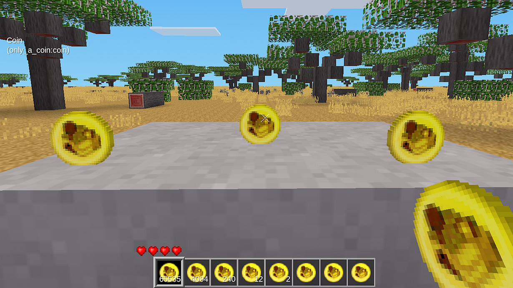

# only_a_coin
 ## Only a Coin
-------------

This mod adds a simple coin to luanti/minetest, to be used as currency.

No gameplay modification, no crafting recipe, no dependencies.
Stacks up to 65535.
 
-------------

-------------

-------------

You can change the image, name, description or even the name of the mod without risking complications.
To change the image, just put a new coin.png (32x32 pixels) in the texture folder. 
coin_base.png in the texture-folder can be used as a template for the new image.

-------------

**License**: Code: MIT , Textures: CC0

**Mod dependencies**: NONE

**Author**: DeadLock